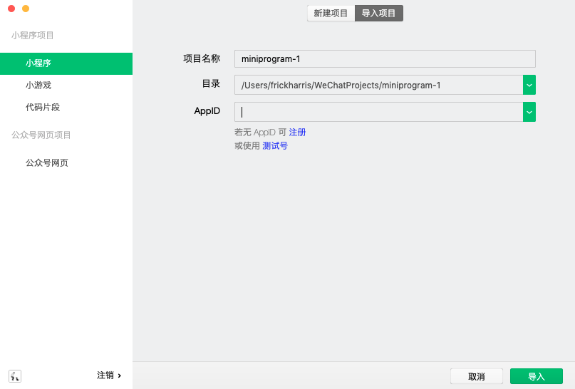
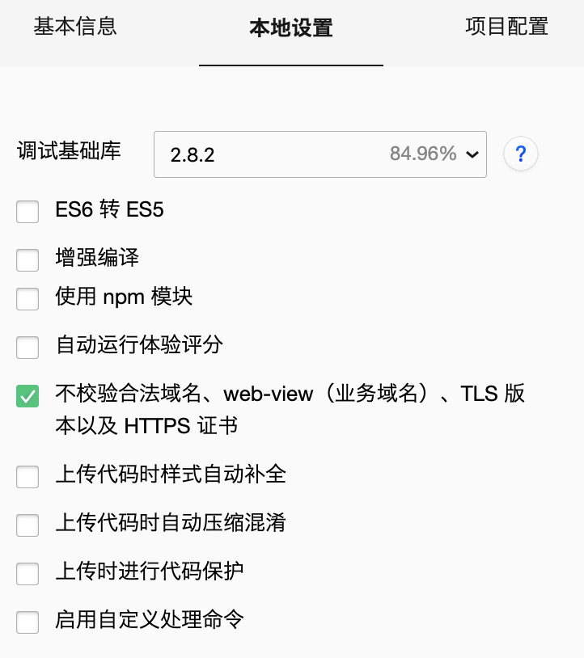

# Tars教学案例

## 前端微信小程序部分
wepy框架 + vant控件

## 项目部署步骤
1. 下载小程序[开发者工具](https://developers.weixin.qq.com/miniprogram/dev/devtools/download.html)
2. 下载项目文件，在终端输入下述命令

```
  cd {$项目文件夹}
  npm install wepy-cli -g
  npm install
  npm run dev
```
说明：
* npm install wepy-cli -g 全局安装或更新WePY命令行工具
* npm install 安装依赖
* npm run dev 或者 wepy build --watch 开启实时编译
  * 其中实时编译在开发的过程中必须一直开启，作用是将wepy代码实时编译成小程序代码(每次ctrl+s会编译对应文件)
1. 将整个**项目文件夹**导入到微信开发者工具

4. 开发时要访问非https的后台可以关闭安全验证

5. wepy框架要求上图本地设置中的其他选项不能勾选

##  项目说明
### 代码风格
开发建议用vscode，下载wepy和小程序的对应插件：
1. wepy snippets
2. minapp
3. wpy-beautify
wepy框架采用vue.js风格，因此该项目的.wpy文件可共用Vue的高亮规则

### 项目目录结构
```
.
├── dist                                       小程序运行代码目录(由build编译后生成)
├── node_modules                               node配置包
├── README.md
├── package-lock.json      
├── package.json            
├── project.config.json
├── src                                        \源文件目录
│   ├── api                                    \接口目录          
│   │   └── request.js                         网络请求接口，接口目录在此文件
│   ├── app.wpy                                全局配置文件，页面注册在此页
│   ├── assets                                 图片、按钮样式目录
│   ├── components                             \wepy组件目录
│   ├── less                                   \less目录
│   └── pages                                  \小程序页面目录
│       ├── club                               \社团模块目录
│       │   ├── activity_info.wpy              活动详情页面
│       │   ├── add_activity.wpy               管理员管理 发布活动页面
│       │   ├── club_index.wpy                 社团模块目录页
│       │   ├── club_info.wpy                  社团详细信息页
│       │   ├── club_manage.wpy                管理员管理 社团目录页
│       │   ├── club_manage_detail.wpy         管理员管理 社团具体页
│       │   ├── create_club.wpy                新建社团页
│       │   ├── manage_activity_info.wpy       管理员管理 修改活动信息页
│       │   └── manage_participants.wpy        管理员管理 活动参与者管理页
│       ├── index.wpy                          小程序主目录页，含登陆验证
│       ├── lovewall                           \表白墙模块目录
│       │   ├── confession.wpy                 表白墙目录页
│       │   └── sendConfession.wpy             发送表白目录页 
│       └── user                               \用户模块目录
│           ├── profile.wpy                    用户个人信息页，含登陆验证
│           └── userinfo.wpy                   个人信息详情页
└── wepy.config.js                             wepy框架的配置文件
```
### 前端接口列表
* 所有request请求的接口均在src/api/request.js文件内
* 接口说明可查看前端接口调用文档
  
### wepy文件的结构
* wepy的具体介绍可以查看wepy 1.x版本的[官方文档](https://wepyjs.github.io/wepy-docs/1.x/#/)
* 小程序的具体介绍可查看小程序的[官方文档](https://developers.weixin.qq.com/miniprogram/dev/framework/)
* app.wpy文件是全局文件所有文件结构会有不同，具体可以查阅官方文档

#### style
标签内的是文本内容，wepy编译成wxss文件，类似于web中的css，语法规则基本一致

#### template
标签内的是布局内容，wepy编译成wxml文件，类似于web中的html。项目中，弹窗类空间统一放在顶部，悬浮按钮类控件统一放在底部。其中用到了部分[vant](https://youzan.github.io/vant-weapp/#/intro)控件，控件的使用在script标签内的config中进行了声明

#### script
标签内的是处理函数，wepy编译成js文件，即web中的js。标签内有几个默认的代码块
1. config里面是页面配置，第三方控件也要在里面声明
2. components里面是原生控件，基本没有使用
3. data里面的是数据，大部分是script标签内的动态文本插值("{{}}"mustache语法)，小部分是状态寄存变量。date里面的数据在script标签内可以用{{变量名}}来访问，在method标签内可以用this指针来访问
4. method里面的大部分是具有监听功能的响应函数，和页面的控件进行了绑定。method外的函数大都是功能性函数
5. onShow()和onLoad都是自带的函数。onShow会在页面显示包括(加载和从后一页回退)的时候执行，onLoad会在页面第一次加载的时候执行
  
### 编译过程
* wepy会先将src目录内的wpy文件编译成小程序对应的wxml、wxss、js文件(对应web中的html、css、js)存储到dist目录，然后微信开发者工具再编译。因此会有两个编译过程。
* wepy的编译会在第一次npm run的时候对所有src目录内的文件进行编译。之后每次保存更新文件都会对单个文件进行编译，console里面的报错也只会显示该文件的报错。
  
### 代码格式
wepy框架有很严谨的代码风格要求，具体错误会在**微信开发者工具**的console中显示

### 调试方法
1. wepy的编译错误会在npm run的**terminal**中显示，小程序的编译错误会在**微信开发者工具**的的console中显示
2. 运行错误会在**微信开发者工具**console中显示。但是用source查看的时候，此时显示的是已经编译过一次的代码
3. 由于一些无法查证的原因，极少的情况下图形界面会出现样式加载不出来但没有任何报错的情况，只需将对应的wpy文件再crtl+s保存一次即可(我猜测是wepy编译出错了)

### 其他问题
#### 官方api
小程序和wepy都有很多官方的api，分别以"wx."和"wepy."进行调用，很多函数同名但使用方式会不同。在官方函数的调用域内，this指针的指向会改变，需要提前保存指向当前页面对象的指针

#### {{}}内的数据更新问题
每次更新完数据之后，wepy有一定的概率对页面进行刷新(至今不知道为什么会是概率事件，wepy的问题)。为了确保刷新，可以使用使用**this.$apply()**函数进行刷新

#### template中的富文本框textarea
textarea是个巨坑，它有很多问题且它的在布局时的优先级是所有控件中最高的(比如它会把其他控件都挤变形)。使用方法比较复杂，至今没完全理解，如有bug建议百度。

### 剩余的工作
1. 在顺鑫的项目有一个ModeificationList.md记录了服务调用的bug
2. 各个输入框没有设置输入内容校验，特别是时间输入框
